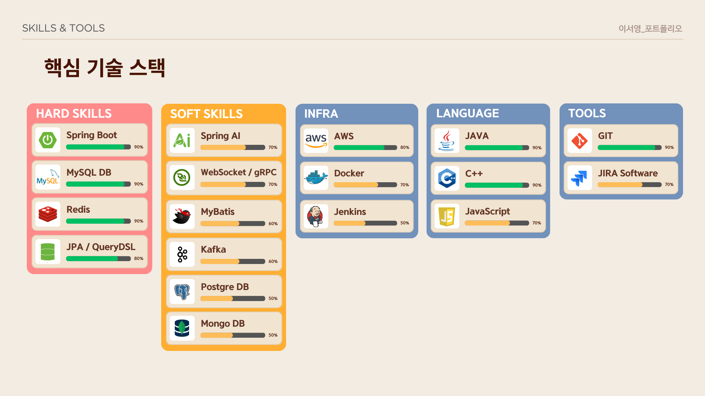

    
    

    
 
    <h2 style="border-bottom: 1px solid #d8dee4; color: #282d33;">  </h2>  
    
  
 
    

    

    <h2 style="border-bottom: 1px solid #d8dee4; color: #282d33;"> 🛠️ Tech Stacks </h2>   
    
 
    
           
    

    

    

    <h2 style="border-bottom: 1px solid #d8dee4; color: #282d33;"> 🧑‍💻 Contact me </h2>   
    
  <h3>  <a href="https://solved.ac/profile/ysyoung4#"> Solved.ac (플레티넘4) </a> </h3> 
 
    
  <h3>  <a href="https://drive.google.com/file/d/1Gb2Oh7GaVFmK-bNFxUUELLI365s96Tle/view?usp=sharing"> 개발자 포트폴리오 </a> </h3> 
  
    
  

    <h2 style="border-bottom: 1px solid #d8dee4; color: #282d33;"> 🏅 Stats </h2> 
   
 
    

